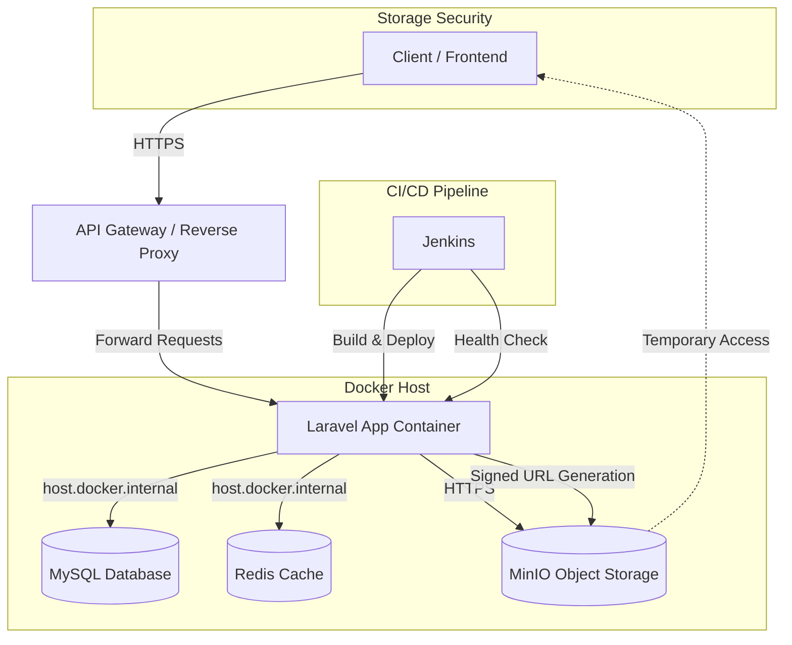

# Inventory Management with Laravel

A production-ready, **multi-tenant Inventory Management System** built with **Laravel 11 (PHP 8.3+)**. Designed for scalability, security, and developer experience with Docker containerization and CI/CD via Jenkins.

---

## 🚀 Overview

This application serves as a comprehensive **Inventory Management System** with the following features:

-   **Product Management**: Hierarchical **Categories**, **Subcategories**, and **Products**
-   **Order Management**: Complete order processing with stock tracking
-   **SaaS Storage**: Secure, tenant-isolated file storage using **MinIO (S3-compatible)**
-   **Authentication**: Stateless **JWT** authentication with **RBAC** (Role-Based Access Control)
-   **Performance**: High-performance caching (**Redis**) and standardized API responses
-   **Audit Logging**: Comprehensive audit trail for all critical operations
-   **Low Stock Alerts**: Automated notifications for inventory thresholds
-   **Developer Experience**: API documentation (Swagger), comprehensive tests, and Docker support

---

## ✅ Requirements

-   **PHP** 8.3+
-   **Composer** 2.x
-   **MySQL** 8.0+ (external or containerized)
-   **Redis** 7.0+ (external or containerized)
-   **Docker** & **Docker Compose** (for containerized deployment)
-   **MinIO** or S3-compatible storage (optional)

---

## 🏗 Architecture

The application uses a **containerized architecture** where the Laravel app runs in Docker and connects to external MySQL and Redis services via `extra_hosts` configuration.



### Key Architecture Points

1. **Containerized Application**: Laravel app runs in a Docker container
2. **External Services**: MySQL and Redis run outside the app container (on host or separate containers)
3. **Extra Hosts**: Uses `host.docker.internal` to connect to host services
4. **Zero-Downtime Deployment**: Jenkins implements blue-green deployment with automatic rollback
5. **Health Checks**: Built-in health monitoring for container orchestration

---

## ⚡ Quick Start

### Option 1: Local Development (Non-Docker)

```bash
# Install dependencies
composer install

# Setup environment
cp .env.example .env
php artisan key:generate

# Configure database in .env
# DB_HOST=127.0.0.1
# DB_PORT=3306
# DB_DATABASE=your_database
# DB_USERNAME=your_username
# DB_PASSWORD=your_password

# Run migrations
php artisan migrate --seed

# Start development server
php artisan serve
```

Visit: `http://localhost:8000`

---

### Option 2: Docker Deployment (Recommended)

This setup assumes you have MySQL and Redis running on your host machine or in separate containers.

#### Prerequisites

1. **MySQL** running and accessible (e.g., on port 3306)
2. **Redis** running and accessible (e.g., on port 6379)

#### Step 1: Configure Environment

```bash
# Copy and configure environment file
cp .env.example .env.local

# Edit .env.local with your settings
nano .env.local
```

**Important environment variables:**

```bash
# Application
APP_ENV=production
APP_DEBUG=false
APP_URL=http://localhost:4002

# Docker Ports
DOCKER_APP_PORT_EXTERNAL=4002      # Port exposed on host
DOCKER_APP_PORT_INTERNAL=4002      # Port inside container
DOCKER_MYSQL_PORT_EXTERNAL=3306    # MySQL port on host
DOCKER_REDIS_PORT_EXTERNAL=6379    # Redis port on host

# Database (connects via host.docker.internal)
DB_HOST=host.docker.internal
DB_PORT=3306
DB_DATABASE=inv_db
DB_USERNAME=inv_user
DB_PASSWORD=your_secure_password

# Redis (connects via host.docker.internal)
REDIS_HOST=host.docker.internal
REDIS_PORT=6379
REDIS_PASSWORD=your_redis_password  # or null if no auth
CACHE_STORE=redis
```

#### Step 2: Build and Run

```bash
# Build the Docker image
docker build -t inventory-management:latest .

# Run with docker-compose
docker compose --env-file .env.local up -d

# Check container status
docker compose ps

# View logs
docker compose logs -f app
```

#### Step 3: Verify Deployment

```bash
# Check container health
docker inspect inventory_app | grep -A 10 Health

# Test API endpoint
curl http://localhost:4002/api/health

# View application logs
docker logs inventory_app
```

---

## 🔧 Docker Configuration Details

### Extra Hosts Explained

The `extra_hosts` configuration in `docker-compose.yml` allows the container to resolve `host.docker.internal` to the host machine's IP:

```yaml
extra_hosts:
  - "host.docker.internal:host-gateway"
```

This enables the containerized app to connect to MySQL and Redis running on the host machine.

### Volume Persistence

Two volumes are created for data persistence:

-   `inventory_storage`: Laravel storage directory
-   `inventory_bootstrap_cache`: Laravel bootstrap cache

### Health Checks

The container includes a health check that verifies the application is responding:

```yaml
healthcheck:
  test: ["CMD-SHELL", "curl -fsS http://127.0.0.1:4002/api/health || exit 1"]
  interval: 15s
  timeout: 5s
  retries: 5
  start_period: 30s
```

---

## 🚀 Jenkins CI/CD Pipeline

The project includes a comprehensive Jenkins pipeline with the following features:

### Pipeline Stages

1. **Clone Repository**: Fetches latest code from GitHub
2. **Resolve Git Commit**: Tags images with commit SHA
3. **Prepare Docker**: Ensures Docker Compose is available
4. **Load Environment**: Loads `.env` from Jenkins credentials
5. **Build Docker Image**: Builds and tags the application image
6. **Backup Current Container**: Renames running container for rollback
7. **Deploy New Container**: Deploys new version
8. **Health Check**: Validates deployment with 60s timeout
9. **Cleanup Old Container**: Removes backup if successful
10. **Cleanup Old Images**: Keeps only last 3 versions

### Zero-Downtime Deployment

The pipeline implements a blue-green deployment strategy:

1. Current container is renamed to `inventory_app_backup`
2. New container is deployed as `inventory_app`
3. Health checks validate the new deployment
4. On success: backup is removed
5. On failure: new container is removed, backup is restored

### Automatic Rollback

If deployment fails at any stage:

-   Failed container is stopped and removed
-   Backup container is restored
-   Previous version continues running

### Setup Jenkins

1. **Create Jenkins Credentials**:
   - ID: `laravel-inv`
   - Type: Secret file
   - Upload your `.env.local` file

2. **Create Pipeline Job**:
   - Point to your repository
   - Use `Jenkinsfile` from repo

3. **Run Pipeline**:
   - Trigger manually or via webhook
   - Monitor deployment stages
   - Check health validation

---

## 🔐 Authentication (JWT)

### Auth Endpoints

-   `POST /api/v1/register`
    ```json
    { "name": "...", "email": "...", "password": "...", "password_confirmation": "..." }
    ```

-   `POST /api/v1/login`
    ```json
    { "email": "...", "password": "..." }
    ```
    Returns: `access_token` (15min) and `refresh_token`

-   `POST /api/v1/refresh`
    ```json
    { "refresh_token": "..." }
    ```

-   `POST /api/v1/logout`
    ```json
    { "refresh_token": "..." }
    ```

### Protected Requests

Add header:
```
Authorization: Bearer <access_token>
```

---

## 📦 Core API Endpoints

### Categories
-   `GET /api/v1/categories` - List all categories
-   `POST /api/v1/categories` - Create category
-   `GET /api/v1/categories/{id}` - Get category
-   `PUT /api/v1/categories/{id}` - Update category
-   `POST /api/v1/categories/{id}/toggle-active` - Toggle status

### Products
-   `GET /api/v1/products` - List products (with search & pagination)
-   `POST /api/v1/products` - Create product
-   `GET /api/v1/products/{id}` - Get product
-   `PUT /api/v1/products/{id}` - Update product
-   `POST /api/v1/products/{id}/toggle-active` - Toggle status

### Orders
-   `GET /api/v1/orders` - List orders
-   `POST /api/v1/orders` - Create order
-   `GET /api/v1/orders/{id}` - Get order details

---

## 🧪 Testing

Run the comprehensive test suite:

```bash
# All tests
php artisan test

# Specific test
php artisan test --filter=ApiFlowTest

# With coverage
php artisan test --coverage
```

---

## 📚 API Documentation

Interactive API documentation is available via Swagger:

-   **URL**: `/api/documentation`
-   **Generate**: `php artisan l5-swagger:generate`

---

## 🔒 Security

-   **JWT Authentication**: Stateless token-based auth
-   **RBAC**: Role-based access control (Superadmin, Admin, User)
-   **Private Storage**: All files served via signed URLs (60min expiry)
-   **Refresh Token Hashing**: Tokens stored hashed in database
-   **CORS Protection**: Configured for production
-   **Input Validation**: All requests validated via FormRequests

---

## 🛠 Troubleshooting

### Container Can't Connect to MySQL

```bash
# Verify MySQL is accessible from host
mysql -h 127.0.0.1 -P 3306 -u your_user -p

# Check if host.docker.internal resolves
docker exec inventory_app ping -c 3 host.docker.internal

# View entrypoint logs
docker logs inventory_app | grep MySQL
```

### Container Can't Connect to Redis

```bash
# Test Redis connection
redis-cli -h 127.0.0.1 -p 6379 ping

# Check Redis from container
docker exec inventory_app redis-cli -h host.docker.internal -p 6379 ping

# View entrypoint logs
docker logs inventory_app | grep Redis
```

### Health Check Failing

```bash
# Check health status
docker inspect inventory_app --format='{{.State.Health.Status}}'

# View health check logs
docker inspect inventory_app --format='{{range .State.Health.Log}}{{.Output}}{{end}}'

# Test endpoint manually
curl http://localhost:4002/api/health
```

### Container Exits Immediately

```bash
# View full logs
docker logs inventory_app

# Check for migration errors
docker logs inventory_app | grep migration

# Run container interactively for debugging
docker run -it --rm --env-file .env.local inventory-management:latest /bin/bash
```

### Jenkins Deployment Fails

```bash
# Check Jenkins console output
# Verify .env credentials are loaded
# Check Docker daemon is accessible
# Verify external MySQL/Redis are running

# Manual deployment test
docker compose --env-file .env.local up -d
docker logs inventory_app
```

---

## 📝 Environment Variables Reference

| Variable | Description | Example |
|----------|-------------|---------|
| `DOCKER_APP_PORT_EXTERNAL` | Host port for app | `4002` |
| `DOCKER_APP_PORT_INTERNAL` | Container port | `4002` |
| `DOCKER_MYSQL_PORT_EXTERNAL` | MySQL port on host | `3306` |
| `DOCKER_REDIS_PORT_EXTERNAL` | Redis port on host | `6379` |
| `DB_HOST` | Database host | `host.docker.internal` |
| `REDIS_HOST` | Redis host | `host.docker.internal` |
| `APP_IMAGE` | Docker image name | `inventory-management:latest` |

---

## 🛠 Tech Stack

-   **Framework**: Laravel 11 (PHP 8.3+)
-   **Database**: MySQL 8.0
-   **Cache**: Redis 7.0
-   **Storage**: MinIO (S3 Compatible)
-   **Containerization**: Docker & Docker Compose
-   **CI/CD**: Jenkins
-   **API Docs**: L5-Swagger / OpenAPI
-   **Testing**: PHPUnit, Pest

---

## 📄 License

Proprietary / Private.

---

## 👥 Contributing

This is a private project. For access or contributions, please contact the repository owner.

